# **NathanBlaga_T1A2 - Portfolio Website Readme**

## **Links:**

### **Published Portfolio Website:** [https://nathanblaga.netlify.app/](https://nathanblaga.netlify.app/)

### **Nathan Blaga GitHub Repo:** [https://github.com/NJBLAGA/NathanBlaga_T1A2](https://github.com/NJBLAGA/NathanBlaga_T1A2)

### **Trello Board - BLAGA - Portfolio:** [https://trello.com/b/7GGV9YiE/portfolio](https://trello.com/b/7GGV9YiE/portfolio)

## **Description of Portfolio Website.**  
  
### **Purpose of Website**

- The purpose of my portfolio website is to create a professional platform in which I can demonstrate my abilities to future employers.
- The website in turn provides the audience with not only the current state of my talents, abilities and coding experience but an insight into my personality, professional knowledge, interests, hobbies and mindset.
- At its core the website was a project as well as a great indicator of where my strengths and weaknesses lie.
  In turn it has created an internal 'roadmap' depicting a more visual understanding of the direction I wish to take on my coding journey.

### **Functionality & Features of Website**

#### **Functionality:**

- The website was designed with the intention of a user friendly experience.
- The content depicted throughout the website fulfils the desired purpose in a manner that allows the user to extract the information and data in an easy and fluent fashion.
- The website's functionality translates across all platforms;
  - Desktop
  - Tablets
  - Mobile devices.

#### **Features:**

- The colour schemes and font styling makes the website very appealing, colourful and welcoming.
- The nav-bar allows for easy navigation between all pages of the website including the individual blog pages themselves.
- The nav-bar 'secondary mode' on mobile devices allows for even further ease of navigation.
- The use of the 'burger' icon over the entire nav-bar creates less of a cluster on mobile devices aiding in the websites visual appearance.
  - A very interesting and 'playful' feature is the 'popup-boxes' on the About Me page.
  - This not only prevents the user for having to scroll down the page to obtain information, but gives the experience a sense of interactivity between the website, myself and the user.

### **Sitemap**

- From initial development of my website, I wanted a very simplistic structure that offered a user friendly interaction alongside smooth navigation between all pages of the site.

 

### **Wireframes**

- Wireframes for portfolio website in:
  - Desktop View.
  - Tablet View.
  - Mobile View.

### **Desktop View**

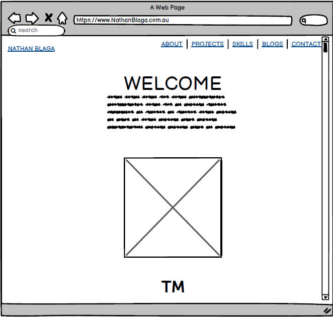
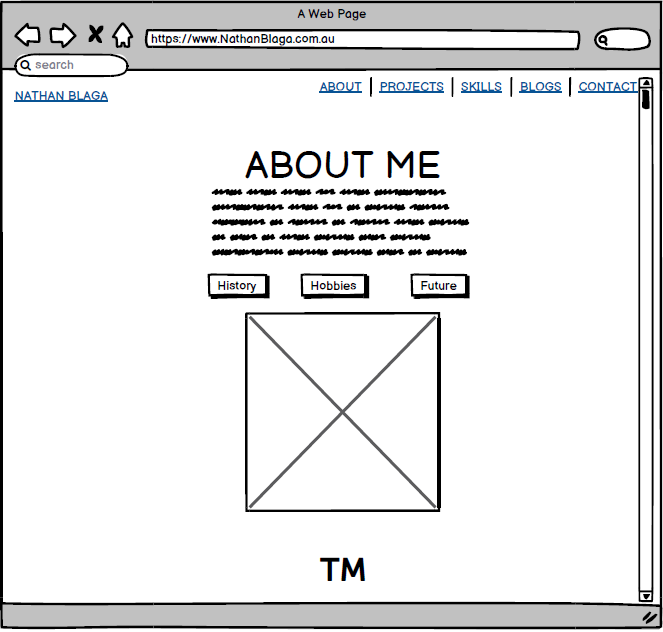
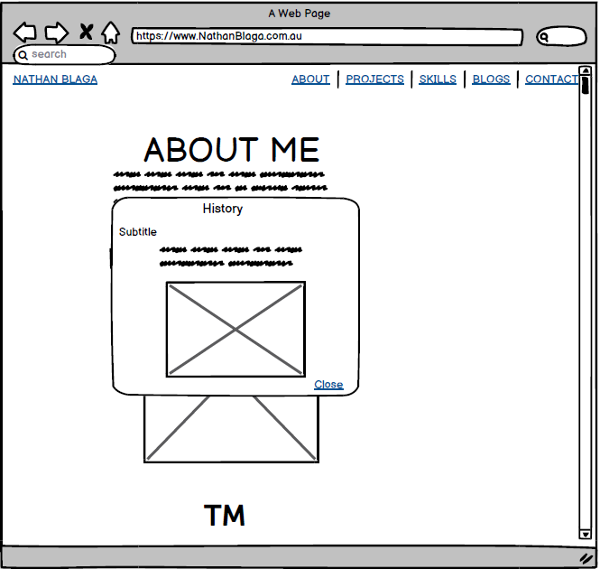

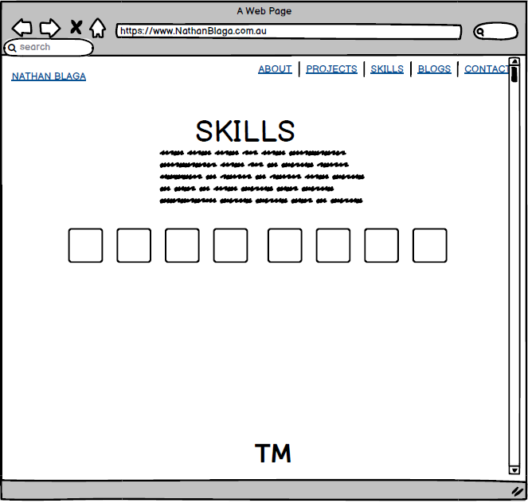
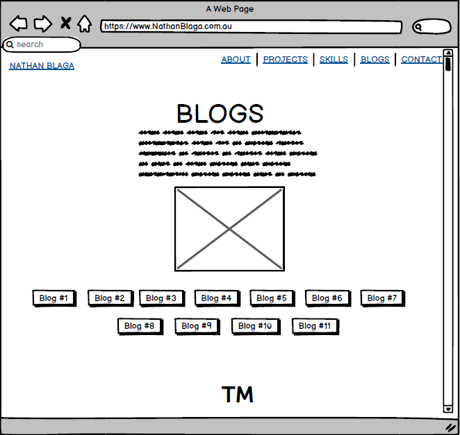
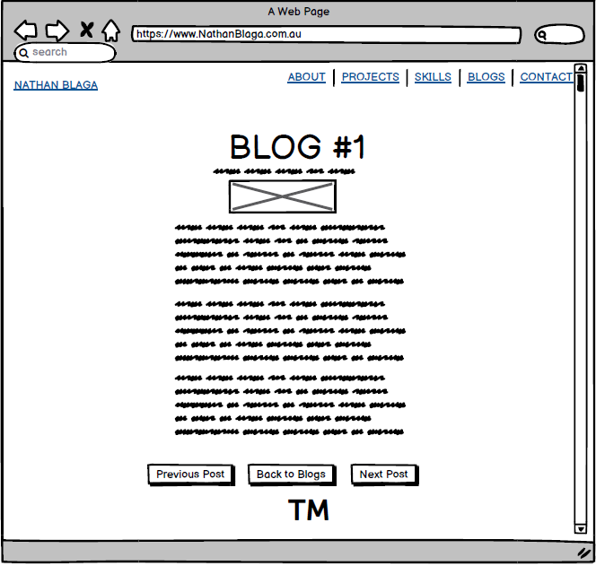
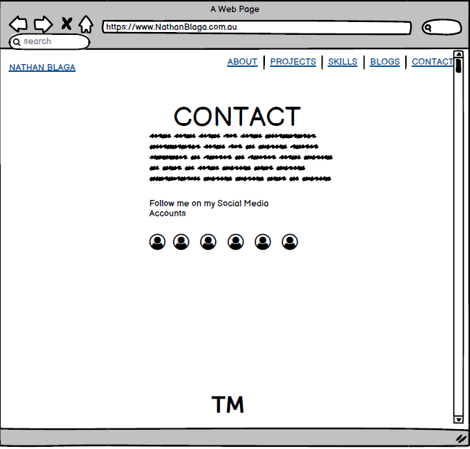

### **Tablet View**

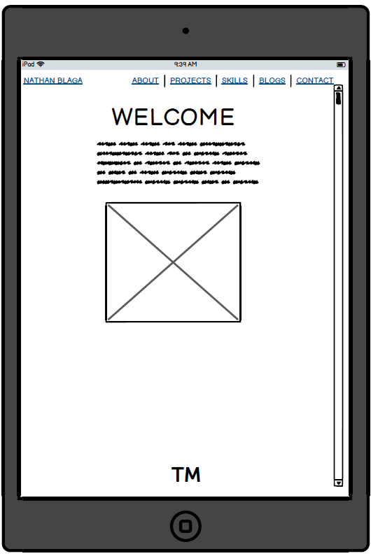
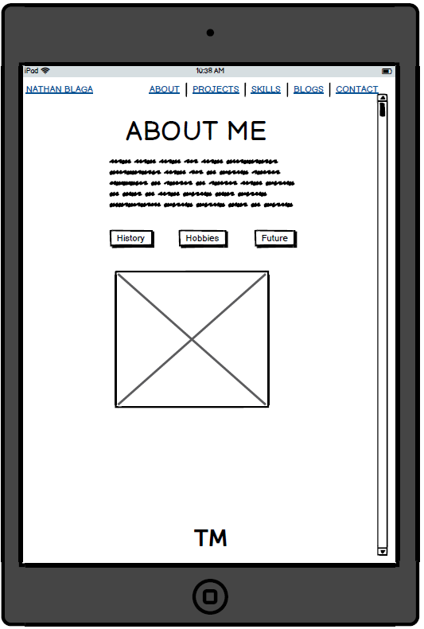
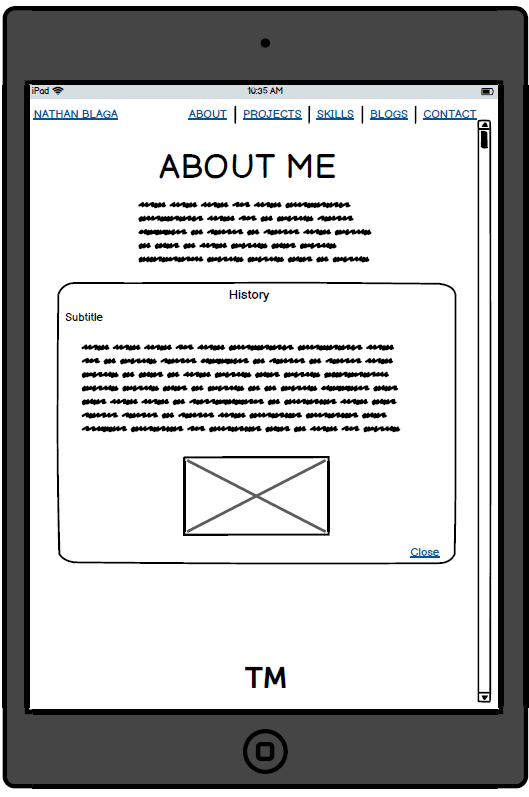
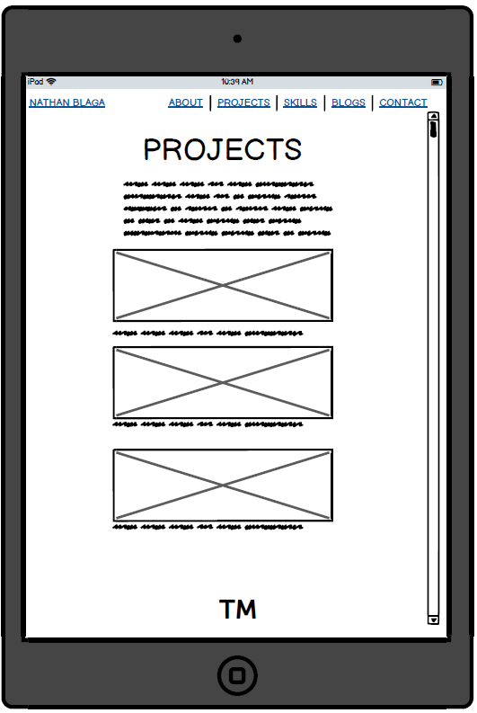
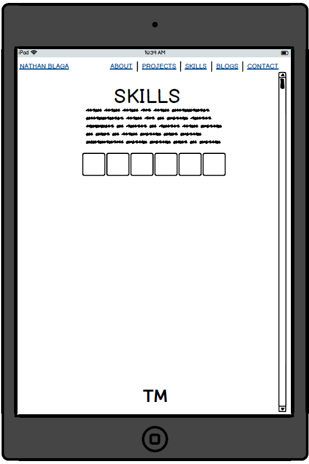
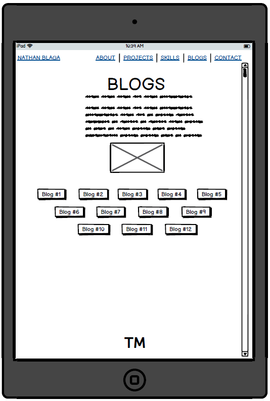
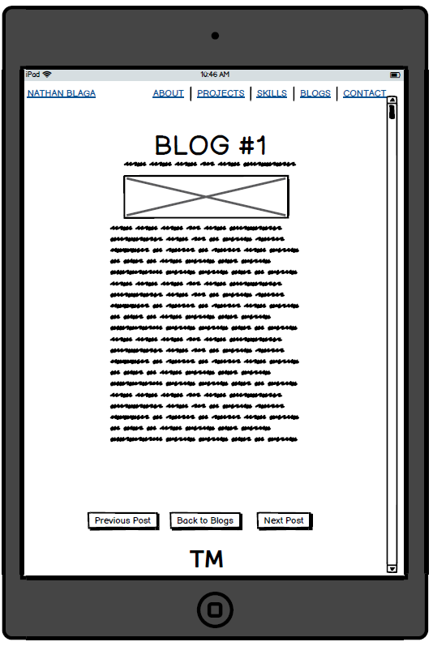
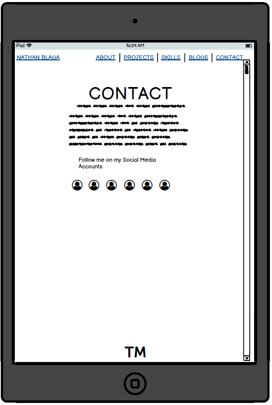

### **Mobile View**

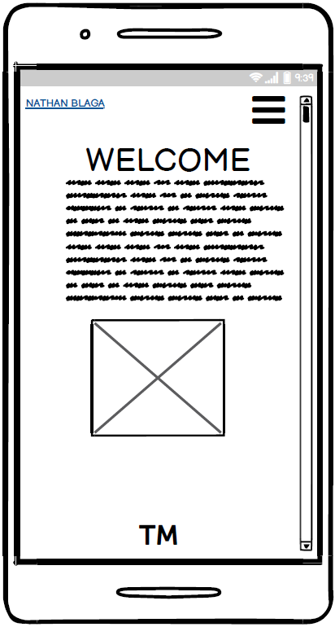
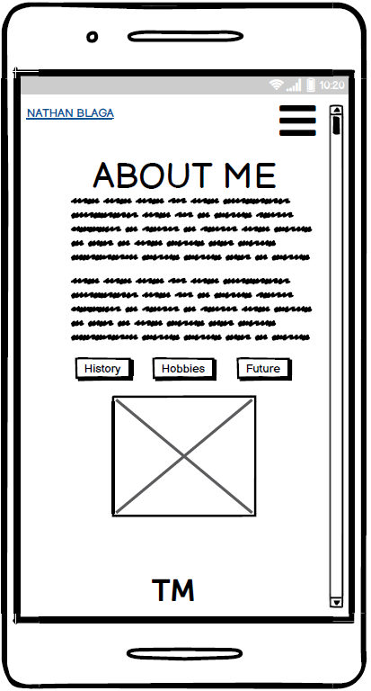
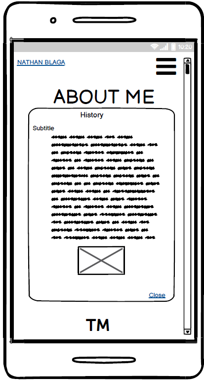
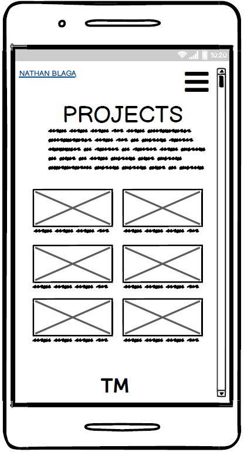
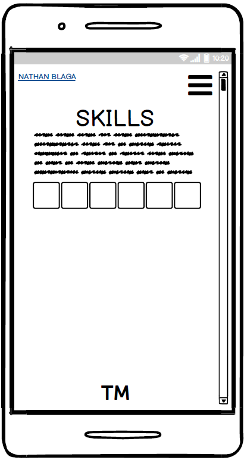
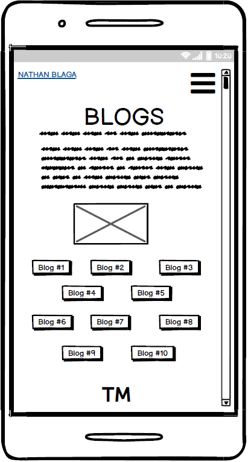
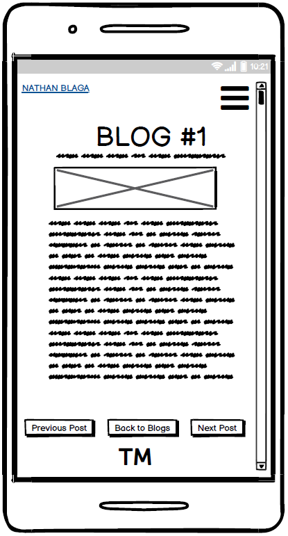
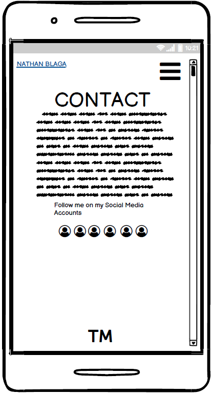

### **Screenshots of Website:**

**NOTE:**

- Website has a  gradient background that transitions every 15secs.
- Hence different colour backgrounds in the following images.

### **Home Page:**

### **About Page:**

### **About Page with Popup Box:**

### **Projects Page:**

### **Skills Page:**

### **Blogs Page:**

### **Blog 1 Page:**

### **Contact Page:**

### **Current Version**

- The current version of the website in comparison to the original design pitched throughout the wireframes show minimal change.
- The original design for the website included a transitional element that would scroll from the right side of the screen to the left.
- The purpose of the page transition was to add value to the site's aesthetics. 
- The page transition was implemented  into an early mockup of the website. However due to functionality restraints, it was removed.
- Tablet and mobile view of the website had minor changes made in regards to element positioning and sizing.
- These changes were implemented to  maximise the sites effectiveness and efficiency when performed on different platforms.

### **Target Audience**

- The target audience of my website are:
- Future employers.
  - The key purpose of this portfolio website is to demonstrate my mindset, passion capabilities and talents for future employment.
- Future clients.
  - The website can also function as a platform to advertise my skills, vision and talents for future clients.
- Like minded developers.
  - In addition to platforms like Git Hub and Code pen, my portfolio website is another staging ground for future collaborations with fellow developers.

### **Tech Stack**

- Throughout my creative process of developing this website, I considered various stacks and platforms.
- Inevitability  the website was developed around a few key stacks.
- The latest version and current version of my portfolio website is composed of the following:
- HTML 5
- CSS
- Java Script
- Netlify
