# **NathanBlaga_T1A2 - Portfolio Website Readme**

## **Links:**

### **Published Portfolio Website:** [https://nathanblaga.netlify.app/](https://nathanblaga.netlify.app/)

### **Nathan Blaga GitHub Repo:** [https://github.com/NJBLAGA](https://github.com/NJBLAGA)

### **Trello Board - BLAGA - Portfolio:** [https://trello.com/b/7GGV9YiE/portfolio](https://trello.com/b/7GGV9YiE/portfolio)

## **Description of Portfolio Website.**  
  
### **Purpose of Website**

- The purpose of my portfolio website is to create a professional platform in which I can demonstrate my abilities to future employers.
- The wesbite in turn provides the audience with not only the current state of my talents, abilities and coding experince but an insight into my personailty, professional knowledge, interests, hobbies and mindset.
- At its core the website was a project as well as a great indicator of where my strengths and weaknessess lie.
  In turn it has created an internal 'roadmap' depicting a more visual understanding of which direction I wish to take on my coding journey.

### **Functionailty & Features of Website**

#### **Functionailty:**

- The website was desgined with the intention of a user friendly experience.
- The content depicted throughout the website fulfills the desire purpose of the website in a manner that allows the user to extract the information and data in an easy and fluent fashion.
- The website's functionality translates across all platforms;
  - Desktop
  - Tablets
  - Mobile devices.

#### **Features:**

- The colour schemes and font styling of the website makes the website very appealing, colourful and welcoming.
- The nav-bar allows for easy navigation between all pages of the website including the individual blog pages themseleves.
- The nav-bar 'secondary mode' on mobile devies allows for even further ease of naivgation.
- The use of the 'burger' icon over the entire nav-bar itself creates less of a cluster on the mobile devices aiding in the websites visual appearance.
  - A very interesting and 'playful' feature is that of the 'popup-boxes' on the about me page.
  - This not only prevents the user for having to scroll down the page to obtain informaiton, but gives the experience a bit of interactivity between the website, myself and the user.

### **Sitemap**

- The sitemap below depicts from an early development stage a very simplistic, user-friendly flow between all pages throughtout the website.

 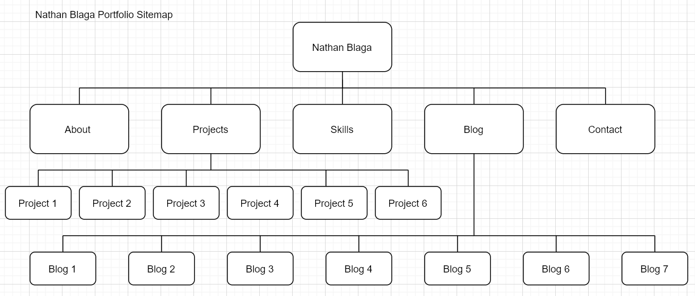

### **Screenshots of Website:**

**NOTE:**

- Website has a  gradient background that transitions every 15secs.
- Hence different colour backgrounds in the following images.

### **Home Page:**

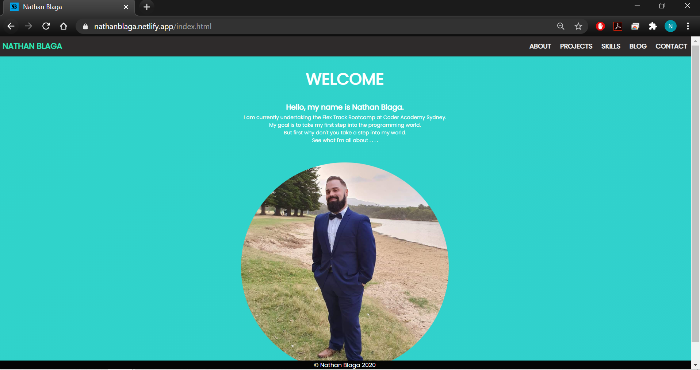
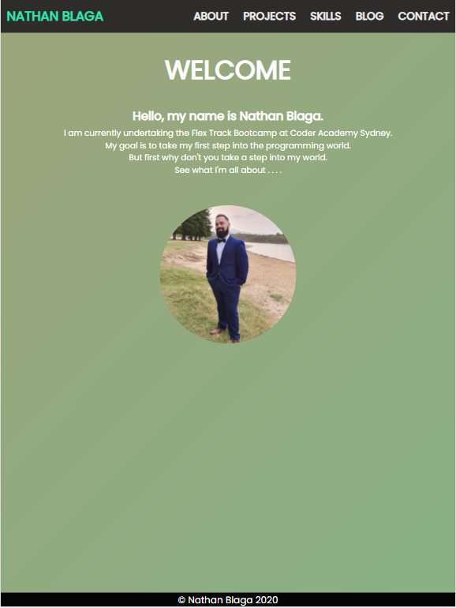
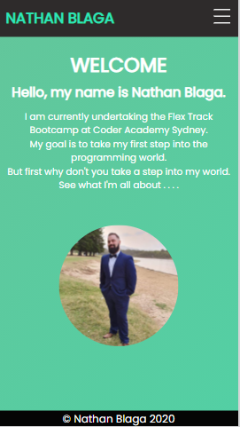

### **About Page:**

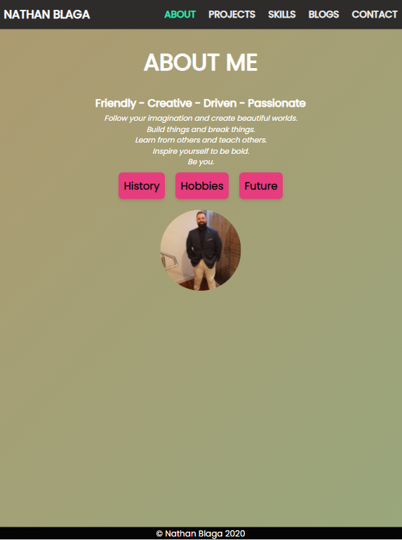
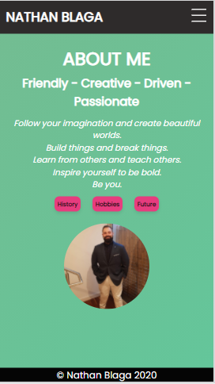

### **About Page with Popup Box:**

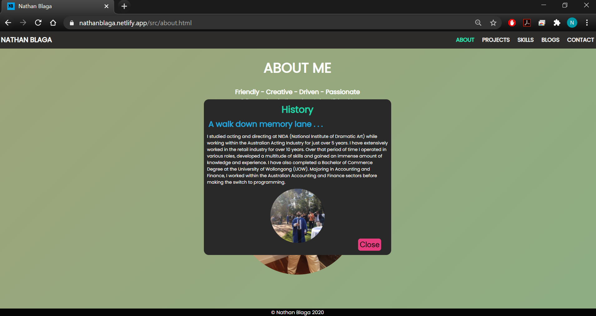
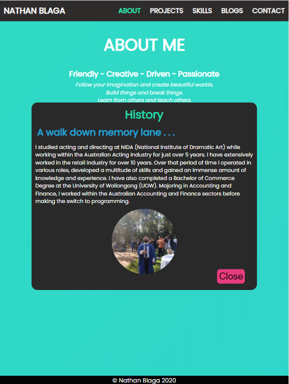
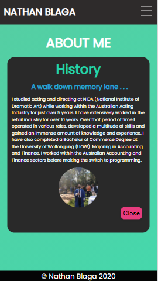

### **Projects Page:**

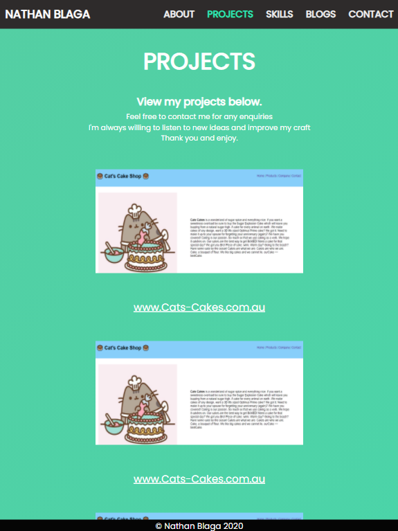
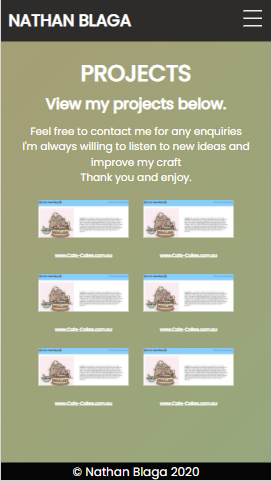

### **Skills Page:**

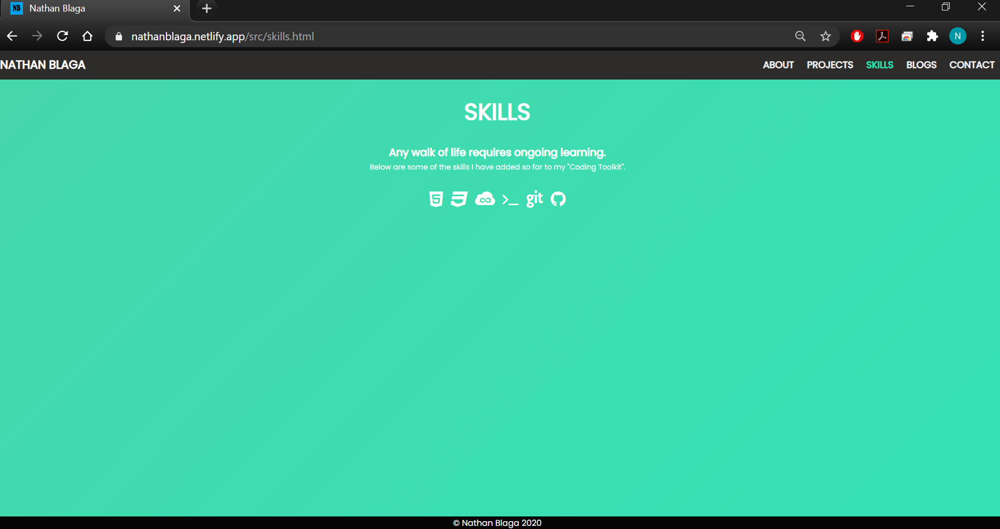
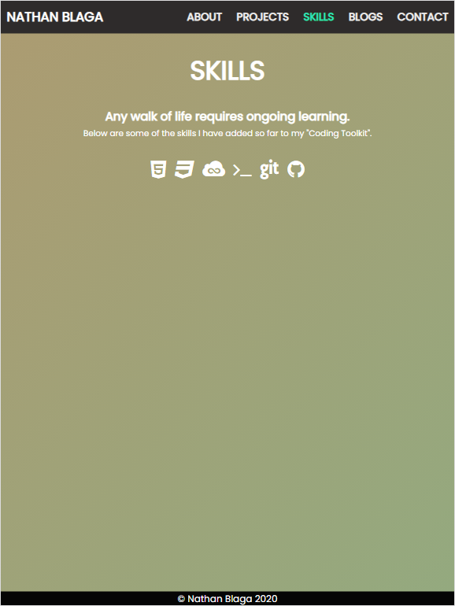
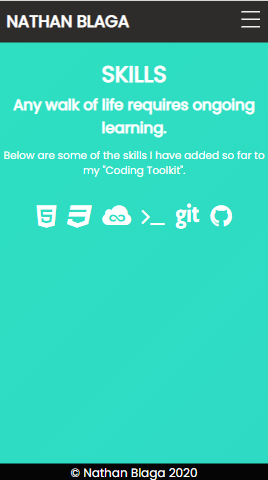

### **Blogs Page:**

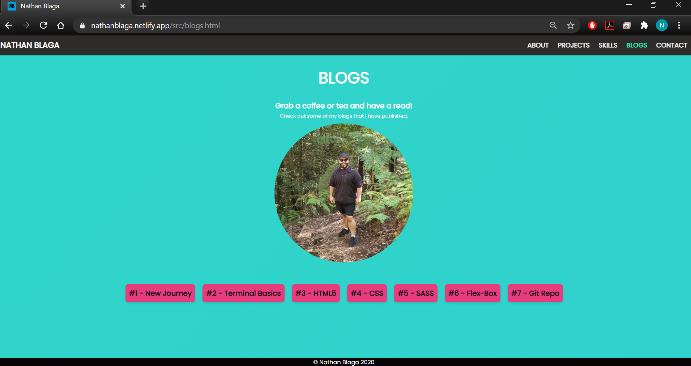
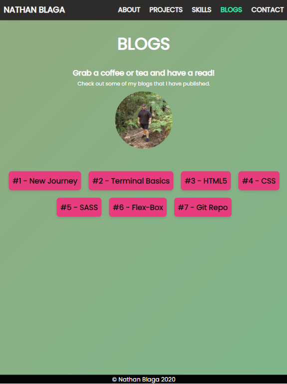

### **Blog 1 Page:**

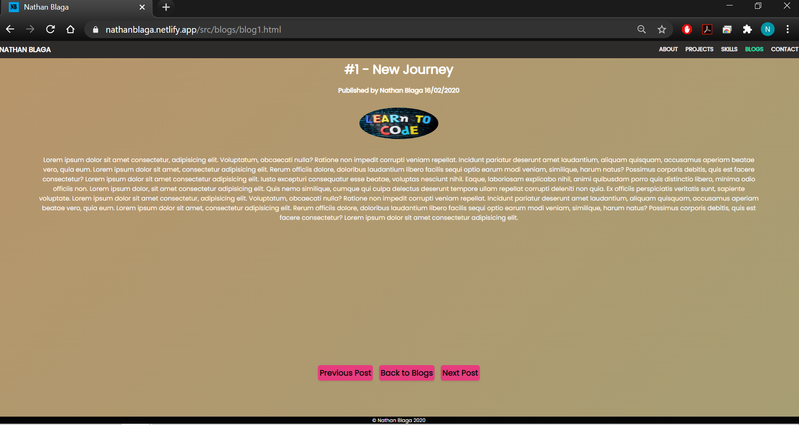
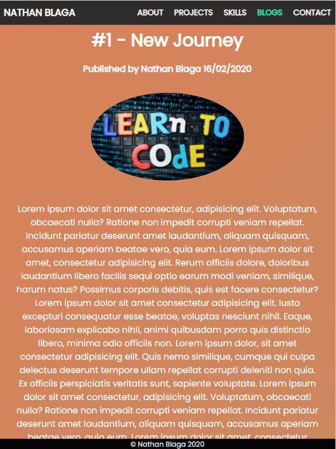
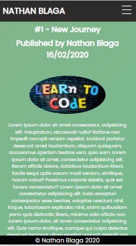

### **Contact Page:**

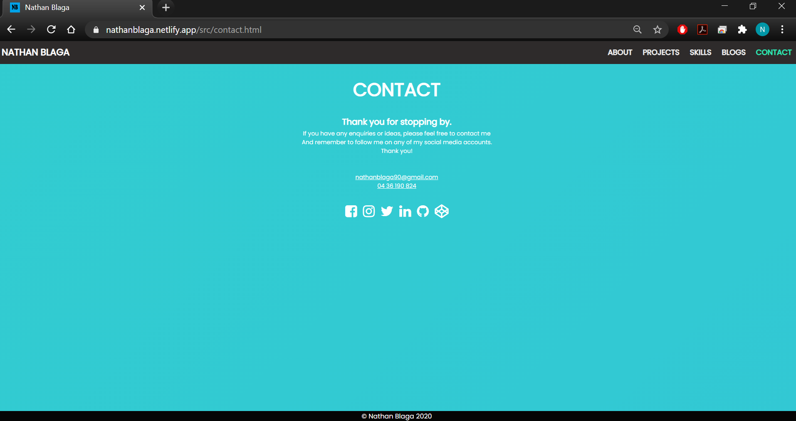
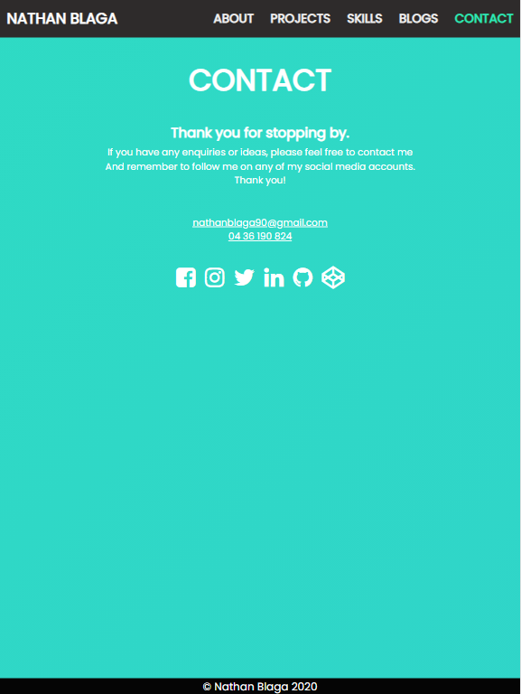
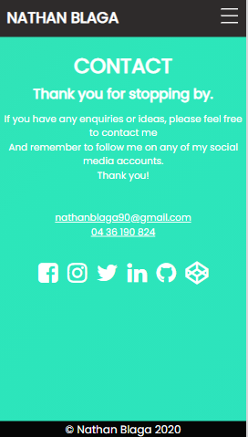

### **Target Audience**

- The target audience of my website is that of;
- Future employers.
  - The key purpose of this portfolio website is to desmonstrate my mindset, passion capabilities and talents for future employment.
- Future clients.
  - The website can also fucntion as a platform to adverstice my skills, vision and talents for future clients.
- Like minded developers.
  - In addition to platforms like Git Hub and Codepen, my portfolio website can be another staging ground for future collaborations with fellow developers.

### **Tech Stack**

- Throughtout my creative process of developing this website, I considered variours stacks and platforms.
- Inevitability  the website was developed around a few key stacks.
- The latest version and current version of my protfolio website is compossed of the following;

- HTML 5
- CSS
- Java Script
- Netlify
